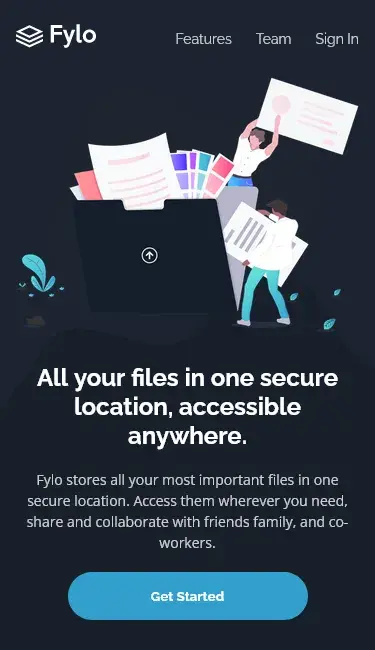

# Fylo Landing Page 🌑

This is a solution to the [Fylo dark theme landing page challenge on Frontend Mentor](https://www.frontendmentor.io/challenges/fylo-dark-theme-landing-page-5ca5f2d21e82137ec91a50fd). Frontend Mentor challenges help you improve your coding skills by building realistic projects.

## Table of contents

- [Overview](#overview)
  - [The challenge](#the-challenge)
  - [Screenshot](#screenshot)
  - [Links](#links)
  - [Built with](#built-with)
- [Author](#author)

## Overview

### The challenge

Users should be able to:

- View the optimal layout for the site depending on their device's screen size
- See hover states for all interactive elements on the page

### Screenshot

Desktop Design

Mobile Design

Active States

### Links

- [Solution URL](https://your-solution-url.com)
- [Live Site URL](https://your-live-site-url.com)

### Built with

- CSS custom properties
- Flexbox
- CSS Grid
- Mobile-first workflow
- [React](https://reactjs.org) - JS library
- [Styled Components](https://styled-components.com) - For styles

## Author

- Website - [josemidev.me](https://josemidev.me)
- Frontend Mentor - [@josemiguel02](https://www.frontendmentor.io/profile/josemiguel02)
- Gmail - [josemidev24@gmail.com](mailto:josemidev24@gmail.com)
